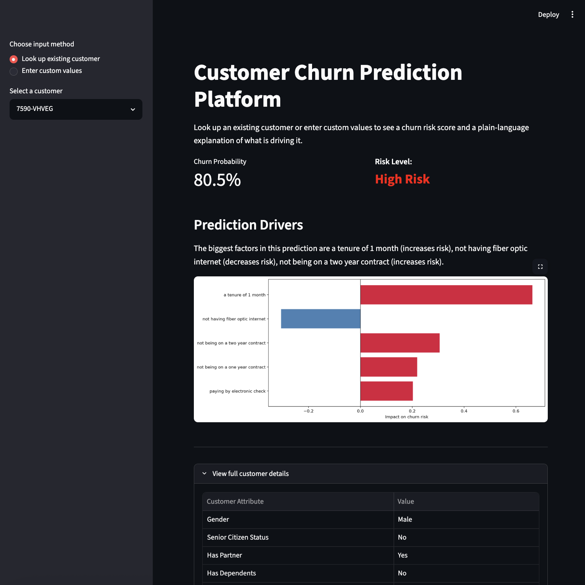

# Customer Churn Prediction Platform (CCPP)

A machine learning project that predicts customer churn for a telecommunications company and explains each prediction in plain language through an interactive Streamlit app.



## What this project does

The goal was to build something that a team could actually use to predict churn and make informed decisions: an interactive app where you look up any customer, get a churn risk score, and see exactly which factors are driving that prediction in language a non-technical person can read.

The system is trained on the IBM Telco Customer Churn dataset (7,032 customers, ~26% churn rate). 

Churn here is an explicit event (a customer cancelled their service), not something inferred from a gap in purchase activity, and the churn rate sits around 26%, which is a workable class balance for binary classification.

XGBoost is the primary model, with logistic regression as a baseline for comparison. SHAP values power the per-customer explanations.

## Project structure

```
customer-churn-prediction-platform/
├── data/
│	├── customer_features.csv
│   ├── telco_clean.csv
│   └── WA_Fn-UseC_-Telco-Customer-Churn.csv                       
├── notebooks/
│   ├── 01_data_wrangling.ipynb
│   ├── 02_feature_engineering.ipynb
│   ├── 03_modeling.ipynb
│   └── 04_shap_explainability.ipynb
├── models/
│   ├── xgb_model.json
│   ├── lr_model.pkl
│   ├── feature_cols.pkl
│   └── shap_global_importance.csv  # Saved model files (generated by notebooks 3 and 4)
├── app.py                       	# Streamlit application
├── requirements.txt
└── README.md
```

## Setup & Quick Start

All commands below are run in your terminal (Terminal on Mac, Command Prompt or PowerShell on Windows)

### 1. Clone the repo

```bash
git clone https://github.com/lbeeler1/customer-churn-prediction-platform.git
cd customer-churn-prediction-platform
```

### 2. Create and activate a virtual environment

For standard installations (Windows, Linux, Intel Macs):
```bash
conda create -p ./.conda python=3.11 -y
conda activate ./.conda
```
For Apple Silicon (M1/M2/M3) Mac users:
If your base Conda installation is running via Rosetta, force a native ARM64 environment by running:
```bash
CONDA_SUBDIR=osx-arm64 conda create -p ./.conda python=3.11 -y
conda activate ./.conda
conda config --env --set subdir osx-arm64
```

### 3. Install dependencies

**Mac users only:** XGBoost and SHAP require the OpenMP runtime to handle parallel processing on macOS. 
Run this command to install it directly into your local environment:
```bash
conda install -c conda-forge llvm-openmp -y
```

Then install the Python dependencies (for all operating systems):
```bash
pip install -r requirements.txt
```

### 4. Launch the Streamlit App

With the pre-trained model weights and processed data assets included directly in the repository, you can launch and interact with the application instantly:

```bash
streamlit run app.py
```

The app opens in your browser at `http://localhost:8501`. You can look up an existing customer by ID or enter custom values for a hypothetical customer. Either way, the app shows a churn probability, a risk level, a plain-language explanation of what is driving the prediction, and a bar chart showing each factor's impact.

## Pipeline Reproduction (Optional)

If you want to explore the data science workflows, recreate the feature engineering steps, or re-train the underlying machine learning models from scratch, you can run the core Jupyter notebooks sequentially. Each notebook saves its output so the next one can pick up where it left off: 

```
01_data_wrangling.ipynb       -loads the raw CSV, cleans the raw data, explores distributions
02_feature_engineering.ipynb  -encodes categorical features, matrix construction, explores correlations with churn
03_modeling.ipynb             -Trains the baseline Logistic Regression and production XGBoost models, evaluates and compares both
04_shap_explainability.ipynb  -generates SHAP explanations, builds plain-language explanation functions
```

If using VS Code with a conda environment, register the kernel first:

```bash
python -m ipykernel install --user --name churn-kernel --display-name "Churn Project"
```

Then select "Churn Project" as the kernel for each notebook.


## Results

| Model | AUC-ROC | Avg Precision | Accuracy | Precision | Recall | F1 |
|-------|---------|---------------|----------|-----------|--------|-----|
| Logistic Regression | 0.8356 | 0.6217 | 0.8045 | 0.6486 | 0.5775 | 0.6110 |
| XGBoost | 0.8400 | 0.6520 | 0.7278 | 0.4927 | 0.8102 | 0.6127 |

XGBoost catches 81% of actual churners (vs 58% for logistic regression) at the cost of lower precision. In a retention context where missing a churner is worse than a false alarm, XGBoost is the better choice.

The top features by SHAP importance are contract type (two year and one year), tenure, fiber optic internet service, monthly charges, and electronic check payment method. The model found that contract type is by far the strongest predictor, accounting for nearly half the total feature importance.

## Tech stack

- **Python 3.11**
- **pandas, numpy** for data wrangling and feature engineering
- **scikit-learn** for preprocessing and model evaluation
- **XGBoost** for the primary classification model
- **SHAP** for model explainability
- **Streamlit** for the interactive web application
- **matplotlib, seaborn** for visualizations

## Dataset

IBM Telco Customer Churn
Available at: https://www.kaggle.com/datasets/blastchar/telco-customer-churn

## Author

Lauren Beeler
